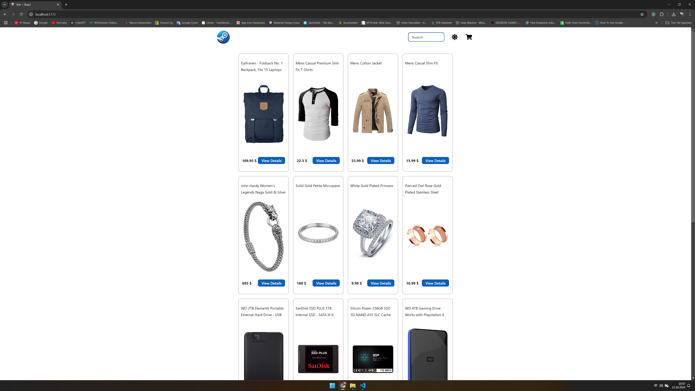
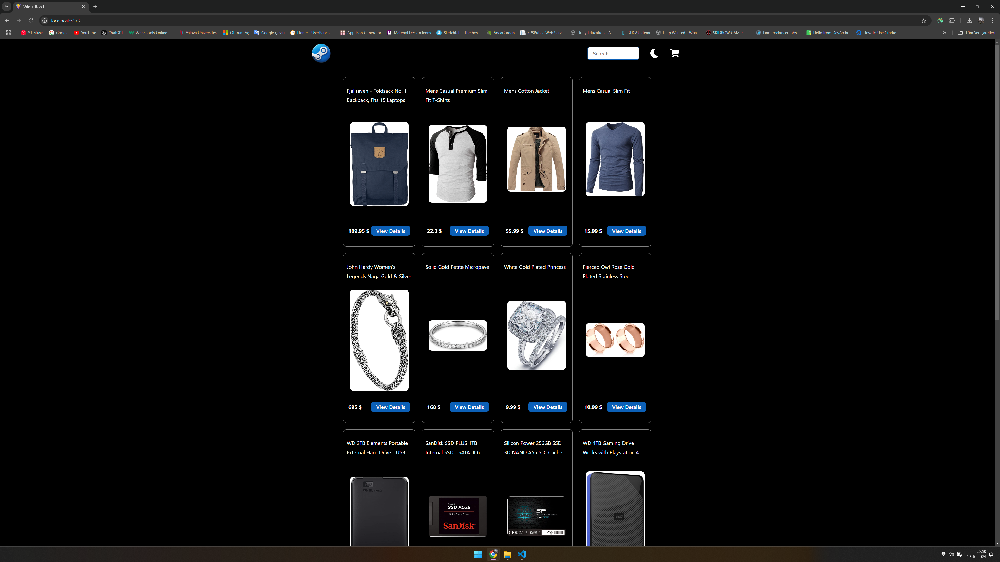
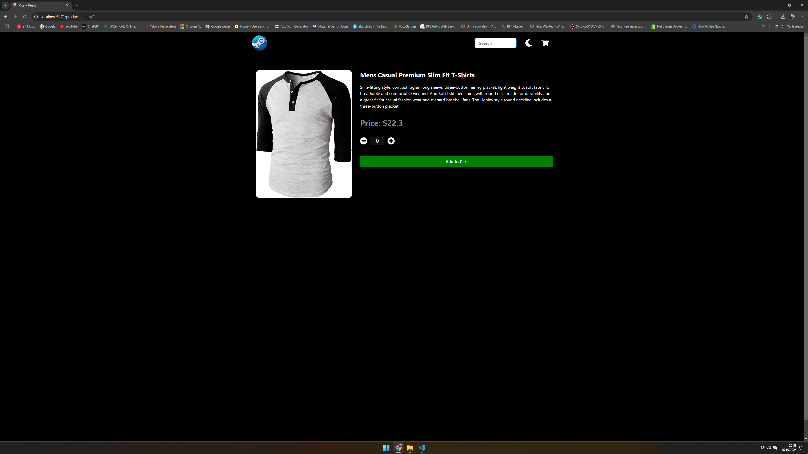
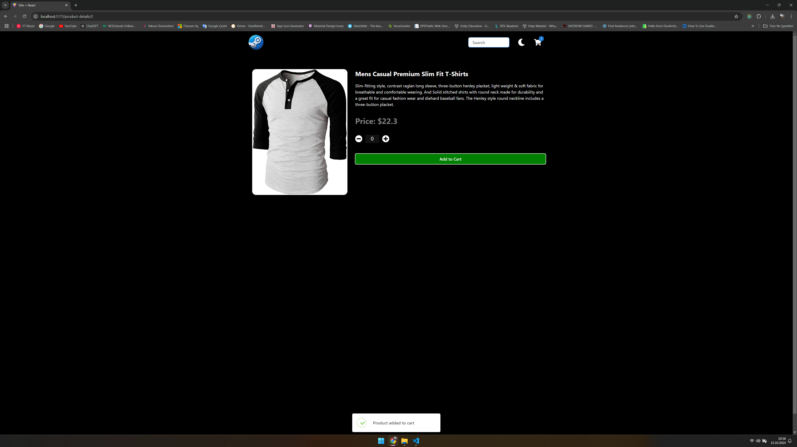
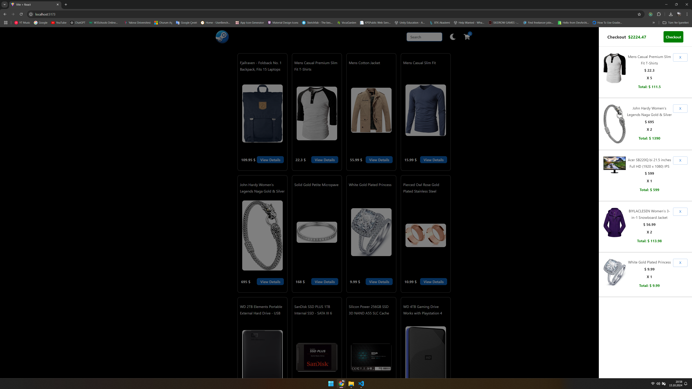
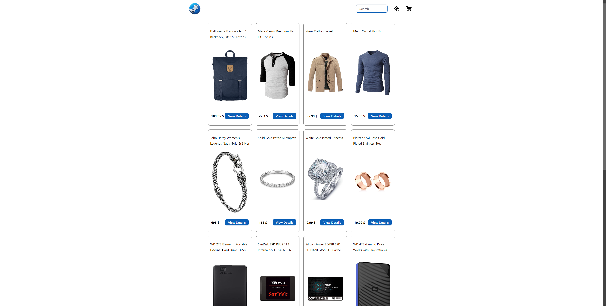

# React ECommerce JS

This react app displays fakeapi products and handles various states.

  "dependencies": {
    "@emotion/react": "^11.13.3",
    "@emotion/styled": "^11.13.0",
    "@mui/material": "^6.1.3",
    "@reduxjs/toolkit": "^2.2.8",
    "axios": "^1.7.7",
    "prop-types": "^15.8.1",
    "react": "^18.3.1",
    "react-dom": "^18.3.1",
    "react-icons": "^5.3.0",
    "react-lottie": "^1.2.4",
    "react-redux": "^9.1.2",
    "react-router-dom": "^6.26.2",
    "sweetalert2": "^11.14.3"
  },

---ScreenShots---

  |    |
  |    |
  |    |

Currently, two official plugins are available:

- [@vitejs/plugin-react](https://github.com/vitejs/vite-plugin-react/blob/main/packages/plugin-react/README.md) uses [Babel](https://babeljs.io/) for Fast Refresh
- [@vitejs/plugin-react-swc](https://github.com/vitejs/vite-plugin-react-swc) uses [SWC](https://swc.rs/) for Fast Refresh
